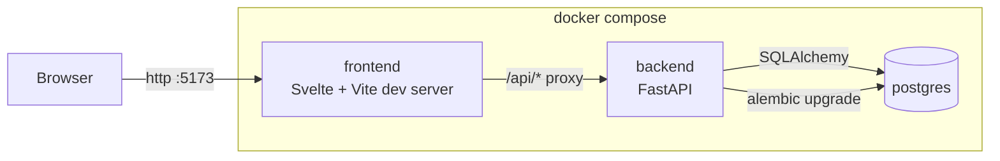
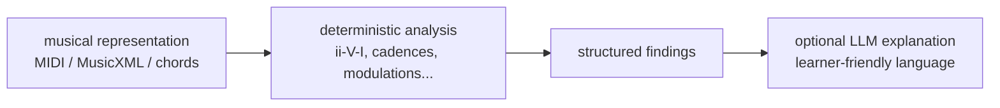

# Architecture

## Scope boundary

v0.1 ("Repertoire Foundation") started intentionally small: Piece CRUD only. v0.2.0 added Piece status/tags and image publishing. Practice-session recording (basic create + list, no statistics/timer/streaks) landed as the first slice of the practice-tracking epic. Sheet-music resources and the music-analysis engine remain future milestones — see [backlog.md](backlog.md). Complexity in this project lives in the engineering workflow (Git Flow, CI, multi-agent conventions), not in the application.

## Stack

| Layer | Choice | Why |
|---|---|---|
| Backend | Python + FastAPI | Typed, async-capable, minimal boilerplate for a small API. See [ADR 0002](adr/0002-backend-stack.md). |
| ORM / migrations | SQLAlchemy 2.0 + Alembic | Explicit schema, typed models, mature migration tooling. |
| Database | PostgreSQL | Reliable, boring, supports future structured data (JSONB for chord progressions etc.) without a second database. |
| Frontend | Svelte + TypeScript + Vite | Small compiled output, no framework ceremony for a 2-page app. See [ADR 0003](adr/0003-frontend-stack.md). |
| Testing | pytest (backend) | Runs against a real Postgres instance, not mocks. |
| Packaging | uv (backend), npm (frontend) | Fast, standard, zero extra tooling. |
| Runtime | Docker Compose (3 containers: postgres, backend, frontend) | One `docker compose up` for the whole stack; no per-dev environment drift. |

## System diagram (v0.1)

## Request flow: Piece CRUD

Browser → Svelte `fetch('/api/pieces')` → Vite dev-server proxy → FastAPI router (`api/pieces.py`) → SQLAlchemy session (`db.py`) → `pieces` table. Response validated against Pydantic schemas (`schemas/piece.py`) both directions.

## Future subsystem: music analysis

Not implemented yet — the architecture leaves room for it without depending on it. The critical design rule: **the LLM is never the source of truth for musical facts.** Deterministic analysis produces structured findings first; an LLM only explains them afterward.

Audio → MIDI → harmony extraction is explicitly out of scope, now and for the foreseeable future — see [backlog.md](backlog.md).

## Related ADRs

- [0001 — Record architecture decisions](adr/0001-record-architecture-decisions.md)
- [0002 — Backend stack](adr/0002-backend-stack.md)
- [0003 — Frontend stack](adr/0003-frontend-stack.md)
- [0004 — Git Flow branching model](adr/0004-git-flow-branching.md)
